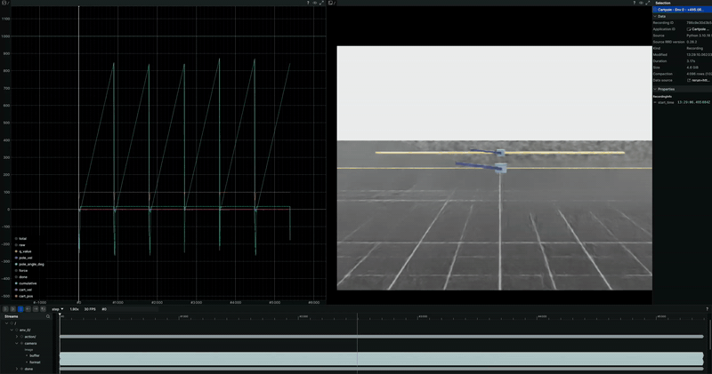

# Inverted Pendulum — RL Swing-Up & Balance

RL-based swing-up and balancing for single and double inverted pendulums in Isaac Lab.

## Tasks

| Task | Env | Obs Dim | Description |
|------|-----|---------|-------------|
| Single Balance | `cartpole_env.py` | 4 | Balance pole starting near upright |
| Single Swing-Up | `cartpole_swingup_env.py` | 5 | Swing pole from hanging to upright |
| Double Swing-Up | `double_pendulum_swingup_env.py` | 8 | Swing both arms from hanging to upright |

All tasks use 1D action (force on cart). Only the cart joint is actuated.

## Training Graphs

[View full training report on Weights & Biases](https://wandb.ai/aadithya-indian-institute-of-technology-jodhpur/cartpole_rl/reports/Assignment--VmlldzoxNTk3OTc4NQ?accessToken=6jagul5ch047pm9vpeow8p4ris992qa38a55olp0whni05zayzcjas4dd3zr3bay)

## Demos

### Single Pole

| Isaac Lab Simulation | Rerun Visualization |
|:-------------------:|:------------------:|
|  |  |

### Double Pole

| Isaac Lab Simulation | Rerun Visualization |
|:-------------------:|:------------------:|
|  |  |

## Project Structure

```
inverted_pendulum/
├── configs/                          # Training hyperparameter configs
│   ├── cartpole_balance.yaml
│   ├── cartpole_swingup.yaml
│   └── double_pendulum_swingup.yaml
├── envs/                             # DirectRLEnv definitions
│   ├── cartpole_env.py               # Single pendulum balance env
│   ├── cartpole_swingup_env.py       # Single pendulum swing-up env
│   ├── double_pendulum_swingup_env.py # Double pendulum swing-up env
│   └── env_wrapper.py                # Obs normalization wrapper
├── training/                         # PPO-LSTM training pipeline
│   ├── agent.py                      # Actor-Critic with LSTM
│   ├── config.py                     # Config loading from YAML
│   └── ppo.py                        # PPO training loop
├── inference/                        # Policy evaluation & logging
│   ├── run.py                        # Single pendulum inference
│   ├── run_double.py                 # Double pendulum inference
│   └── visualize_rerun.py            # Rerun visualization of logged data
├── DoublePendulumURDF/               # Custom URDF for double pendulum
│   ├── robot.urdf
│   └── assets/                       # STL meshes
├── train.py                          # Training entry point
├── teleop_env.py                     # Keyboard teleop through gym env
├── teleop_swingup.py                 # Raw articulation teleop (single/double)
├── teleop_double.py                  # Double pendulum teleop with GUI sliders
└── logs/                             # Checkpoints & inference logs
```

## Installation

Requires Isaac Lab (Isaac Sim 4.x). From the IsaacLab root:

```bash
# Activate Isaac Lab conda/venv environment
conda activate isaaclab  # or your env name

# Verify Isaac Lab is working
python -c "from isaaclab.app import AppLauncher; print('OK')"
```

No additional packages needed beyond the Isaac Lab installation.

### Rerun Visualization (separate env)

Rerun is used for visualizing inference logs (trajectories, rewards, camera frames). Since it can conflict with Isaac Sim dependencies, install it in a separate conda environment:

```bash
# Create or use a separate analysis environment
conda activate analysis

pip install rerun-sdk numpy

# Run visualization
python scripts/inverted_pendulum/inference/visualize_rerun.py \
    --test_name cartpole_test --env_id 0

# Or point directly to a data file
python scripts/inverted_pendulum/inference/visualize_rerun.py \
    --data_path scripts/inverted_pendulum/logs/inference/double_pendulum_test/env_0_data.npz
```

Rerun opens a viewer in your browser. The `.npz` files are self-contained — no Isaac Lab needed for visualization.

## Training

Training uses a custom PPO-LSTM pipeline. Point `train.py` at the desired env by editing the `make_env` function, then run:

```bash
# Single pendulum swing-up
python scripts/inverted_pendulum/train.py \
    --config scripts/inverted_pendulum/configs/cartpole_swingup.yaml \
    --num_envs 256

# Double pendulum swing-up
# (first update make_env in train.py to point to DoublePendulumSwingUpEnv)
python scripts/inverted_pendulum/train.py \
    --config scripts/inverted_pendulum/configs/double_pendulum_swingup.yaml \
    --num_envs 256
```

Checkpoints are saved to `logs/checkpoints/<exp_name>/`. Training logs to Weights & Biases if `wandb_enabled: true` in the config.

## Inference

```bash
# Single pendulum
python scripts/inverted_pendulum/inference/run.py \
    --checkpoint_path scripts/inverted_pendulum/logs/checkpoints/cartpole_swingup/best.pt \
    --config scripts/inverted_pendulum/configs/cartpole_swingup.yaml \
    --num_envs 2 --num_episodes 5

# Double pendulum
python scripts/inverted_pendulum/inference/run_double.py \
    --checkpoint_path scripts/inverted_pendulum/logs/checkpoints/double_pendulum_swingup/best.pt \
    --config scripts/inverted_pendulum/configs/double_pendulum_swingup.yaml \
    --num_envs 2 --num_episodes 5

# With camera recording
python scripts/inverted_pendulum/inference/run_double.py \
    --checkpoint_path <path> --config <path> --record_cameras --enable_cameras
```

Inference logs (observations, rewards, actions, camera frames) are saved to `logs/inference/<test_name>/` as `.npz` files.

## Keyboard Teleop

For testing environments manually before training:

```bash
# Test through the actual gym env (with rewards, termination, obs printout)
python scripts/inverted_pendulum/teleop_env.py --task swingup
python scripts/inverted_pendulum/teleop_env.py --task double_swingup

# Raw articulation teleop (single or double pendulum)
python scripts/inverted_pendulum/teleop_swingup.py --task single
python scripts/inverted_pendulum/teleop_swingup.py --task double

# Double pendulum with GUI sliders for joint inspection
python scripts/inverted_pendulum/teleop_double.py
python scripts/inverted_pendulum/teleop_double.py --no_gravity
```

**Controls:** A/D = push cart, UP/DOWN = adjust force, R = reset

## Observation Spaces

**Single pendulum (5D):** `[cos(pole), sin(pole), pole_vel, cart_pos, cart_vel]`

**Double pendulum (8D):** `[cos(arm1), sin(arm1), arm1_vel, cos(arm2), sin(arm2), arm2_vel, cart_pos, cart_vel]`

Angles use cos/sin encoding to avoid wrapping discontinuities.

## Reward Structure

- **Upright reward:** `cos(angle)` per arm — +1 when upright (angle=0), -1 when down (angle=pi)
- **Cart position penalty:** `-0.005 * cart_pos^2`
- **Velocity penalties:** small penalties on cart and arm velocities
- **Termination penalty:** applied when cart exceeds bounds (+-3m for single, configurable for double)
- **No pole angle termination** — agent is free to swing

## Key Design Decisions

- **URDF vs USD:** Single pendulum uses Isaac Lab's built-in `CARTPOLE_CFG` (USD). Double pendulum uses a custom URDF (`DoublePendulumURDF/robot.urdf`) loaded via `UrdfFileCfg`. The URDF is based on [DoublePendulumIsaacLab](https://github.com/NRdrgz/DoublePendulumIsaacLab) with modifications to joint origins so that 0 radians for both revolute joints corresponds to arms pointing straight upright.
- **Environment cloning:** `replicate_physics=True` for collision filtering between envs. `clone_in_fabric` is not used (incompatible with URDF assets).
- **Actor-Critic architecture:** LSTM + MLP heads, separate actor and critic networks.
